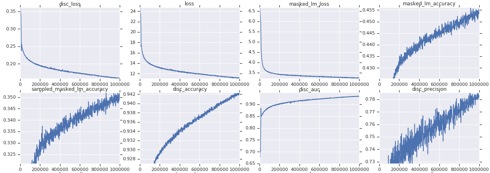
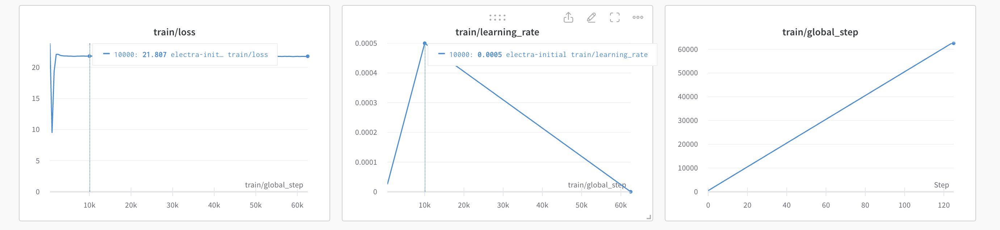
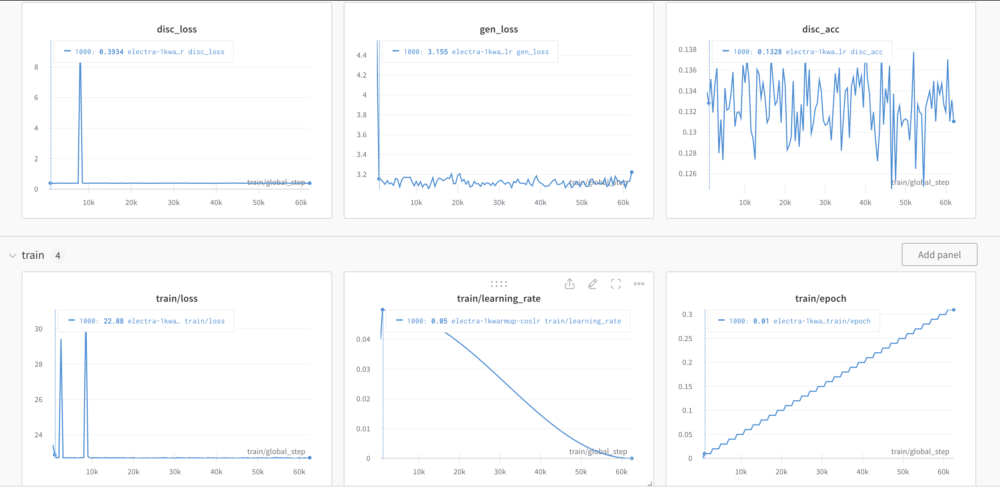

# Electra_replicate
Replication of Electra-small model 6.25% trained using PyTorch

Paper: ICLR 2020 paper [ELECTRA: Pre-training Text Encoders as Discriminators Rather Than Generators](https://openreview.net/pdf?id=r1xMH1BtvB).

Official released code: [google-research/electra](https://github.com/google-research/electra)

# Code
The code contains two parts, pretrain and finetune.

Pretrain code includes replication of the Electra model according to the paper. I used HuggingFace Trainer for trainning and trained on one v100 GPU for 6 hours.\
For the dataset, the data used in the paper is not publicly available, so I follow the released code using [OpenWebTextCorpus](https://skylion007.github.io/OpenWebTextCorpus/) instead. 

Finetune code includes using pretrained model with GLUE tasks. The detailed results can be viewed in results_Glue.txt.

### To run the code
First install all required packages
```
pip install -r requirements.txt
```
To pretrain the model, run the comand line code like
```
python3 training/run_pretrain.py --batch_size 128 --lr 5e-2 --warmup_steps 625 --weight_decay 0.01 --max_steps 62500
```
To run the pretrained model on Glue, run the comand line code like
```
python3 training/run_finetuning.py
```

# RESULTS
pretrain loss: 21.793

## GLUE Avarage Score

|  | CoLA | SST | MRPC | STS  | QQP  | MNLI | QNLI | RTE |
| --- | --- | --- | --- | ---  | ---  | --- | --- | --- | 
| [ELECTRA-Small-OWT](https://github.com/google-research/electra) | 56.8 | 88.3 | 87.4 |  86.8 | 88.3  | 78.9 | 87.9 | 68.5 | -- | -- |  -- |
| ELECTRA-Small-Replicated | 38.03 | 63.92 | 67.49 |  69.91 | 75.18  | 63.92 | 63.54 | 60.29 | -- | -- |  -- |

Average GLUE ELECTRA-Small (from paper) = 79.9 \
Average GLUE ELECTRA-Small(6.25%trained) (from paper) = 74.1 \
Average GLUE ELECTRA-Small-OWT (from [official released code](https://github.com/google-research/electra))= 80.36 \
Average GLUE Relicated(6.25%trained)= 66.785

# ANALYSIS
Calculating using the same scale of 6.25% trained and fully trained small model performance, the replicated model is about 10% below the estimated result. Here is my thinking and approaches for solution.\
In the training, according to the training loss curves logged, the loss stops decreasing after warmup steps. With the research online, I began with the approach of fine-tuning the hyper-parameters. After fine-tuning some hyper-parameters (increasing the learning_rate to `learning_rate=5e-2`, decreasing warmup steps to `warmup_steps=625`) and changing `lr_scheduler_type = "cosine_with_restarts"` from `linear`, but there still exists the same pattern. \
Other than the paramter tuning, I plot the loss and accuracy of both generator and discriminator model separately. The result of the loss of generator model shows the same pattern as the total_loss, both stop decreasing after the warmup steps. \
Hope I could learn more for the reason and then I will reimplement the necessary part for future validation.

# Graphs of Training curve
**Graph 1: [Google released pre-training curves for the small model on OpenWebText](https://github.com/google-research/electra/issues/3)**

(x-axis is pre-train steps) \
The loss at the step 62500 should be around 15.

**Graph 2: My pre-training curves for the small model with the same parameters as the paper**

[wandB log link for this run is here.](https://wandb.ai/kliang/huggingface/runs/bwkg4b2a?workspace=user-kliang)
The loss is around 21 after the warmup steps.

**Graph 3: My pre-training curves for the small model after fine-tuning the hyper-parameters and changing to the cosine lr_scheduler type.** And adding the generator and discriminator model accuracy.

The Electra model loss is around 22, and still  stops decreasing after warmup steps. \
[wandB log link for this run is here.](https://wandb.ai/kliang/huggingface/runs/uzzjzir5?workspace=user-kliang)

# Additional Functions
To better understand the issue of the non-decreasing loss curve, I implemented the functions calculating the accuracy and loss of the generator and discriminator model. I also plot them in the **Graph 3** above. The logging shows that the generator model is experiencing the same issue of a non-decreasing loss curve after the warmup steps. My analysis is generator model is relatively small compared with the discriminator, which causes it to decrease slowly after a number of steps. I need more experiments to have further validation.